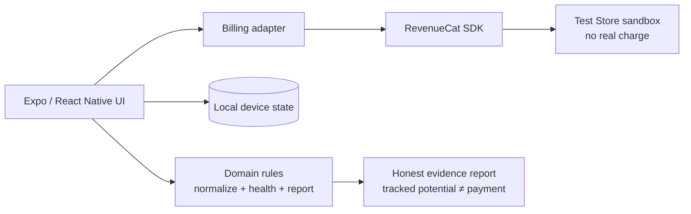

# ProofPocket architecture

ProofPocket is intentionally local-first. Opportunity records and evidence stay
on the device; RevenueCat is used only for the guarded premium entitlement and
the sandbox purchase path.

## Boundaries

- The local store contains opportunities, evidence checkpoints, and status.
- Domain rules reject malformed or non-positive USD amounts before totals change.
- The billing adapter accepts only the owner-supplied public RevenueCat key and
  normalizes both CommonJS and default-export module shapes.
- A failed billing reconfiguration clears any previously configured client so a
  stale session cannot be used accidentally.
- No card number, secret key, tax document, or payout credential is stored in
  this repository.

## Verification path

1. Run `pnpm validate` for structural and manifest checks.
2. Run `pnpm typecheck` for TypeScript checks.
3. Use the RevenueCat Test Store only; production products and store release
   remain explicit owner-controlled gates.
